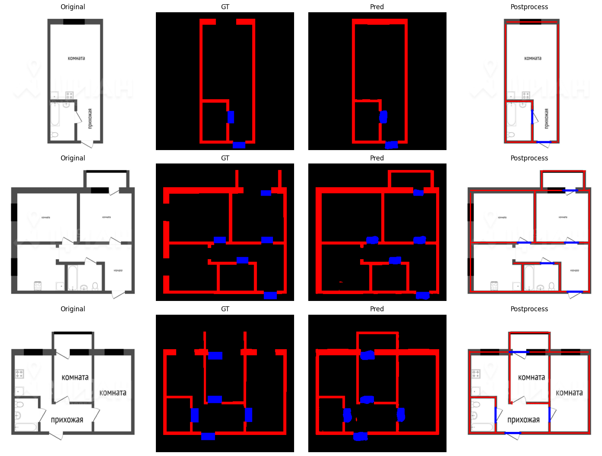

# Floor Plan → JSON (walls/doors/windows) — mini prototype

Небольшой прототип для тестового задания: по изображению плана (PNG/JPG) строит семантическую сегментацию (стены/окна/двери), затем делает постобработку и возвращает JSON с геометрией (стены и двери). Дополнительно сохраняет визуализацию (оригинал / сегментация / результат постпроцесса).

---

## Что сделано

- **Семантическая сегментация (нейросеть)**:
  - Архитектура: **U-Net++ (UNetPP)** для 1-канального входа (grayscale)
  - Классы: `0 background`, `1 wall`, `2 window`, `3 door`

- **Функция потерь**:
  - `Weighted Dice + Focal` для борьбы с дисбалансом классов
  - `Boundary loss` (через лапласиан) для более “ровных” границ стен  
  - Итог: `total_loss = region_loss + boundary_weight * boundary_loss`

- **Постобработка (OpenCV)**:
  - чистка маски (morph close/open)
  - **скелетизация** стен 
  - HoughLinesP для получения сегментов стен
  - объединение и “склейка” коллинеарных сегментов
  - двери ищутся как места где есть **разрывы** в стенах и дверь на сегментации

- **Выходные данные**:
  - JSON с базовой структурой:
    ```json
    {
      "meta": { "source": "test.png" },
      "walls": [{ "id": "w1", "points": [[x1,y1],[x2,y2]] }],
      "doors": [{ "id": "d1", "points": [[x1,y1],[x2,y2]] }],
      "windows": []
    }
    ```


---

## Почему такой стек

- **U-Net++** хорошо подходит под планы: сильные skip-connection’ы, устойчиво восстанавливает тонкую геометрию (стены/проёмы) при ресайзе.
- **Weighted Dice + Focal** — стандартная комбинация, когда есть сильный дисбаланс и много “фона”.
- **Boundary loss** добавляет сигнал именно по границам, помогает аккуратнее “держать” контур стен.
- **OpenCV постпроцесс** нужен, чтобы перевести пиксельную маску в геометрию (линии/сегменты), пригодную для дальнейшего экспорта в 2D/3D.


## Слабые места текущего решения

1. **Качество разметки датасета**
   В процессе работы с данными было замечено большое количество ошибок в разметке:

   * разрывы стен,
   * неточные границы,

   Это напрямую влияет как на качество сегментации, так и на стабильность постпроцессинга, так как последний сильно опирается на корректную геометрию масок.

2. **Неидеальный постпроцессинг геометрии**
   Алгоритм извлечения стен и дверей (скелетизация + Hough + геометрические эвристики) чувствителен к шуму и дефектам маски. Из за этого возникают:

   * лишние короткие сегменты,
   * пропуски стен

3. **Однотипность данных**
   В датасете присутствует большое количество визуально очень похожих планов:

   * одинаковый масштаб,
   * схожие толщины стен,
   * однотипный стиль чертежей.

   Это ухудшает обобщающую способность модели.


## Что можно улучшить в следующей итерации

1. **Исправление и унификация разметки**

   * ручная валидация части датасета,
   * выравнивание классов (стены / двери / окна),
   * устранение разрывов и пересечений в масках.

   Это даст наибольший прирост качества как сегментации, так и постпроцессинга.

2. **Расширенные аугментации**
   Для борьбы с однотипностью данных:

   * масштабирование и случайный DPI,
   * перспективные искажения,
   * шум, размытие, JPEG-артефакты,

   Это позволит модели лучше работать с реальными фотографиями и сканами.

3. **Более устойчивый постпроцессинг**

   * кластеризация линий по направлению и положению,
   * объединение сегментов через графовую модель,
   * явная реконструкция комнат и контуров помещений.


---
## Использование

pip install -r requirements.txt  
python try.py [путь к изображению]

Для интерактивного теста использовать ноутбук test.ipynb
